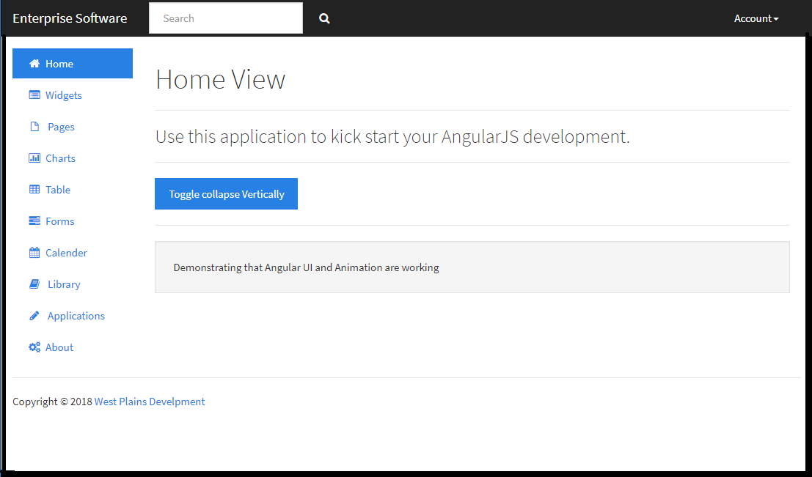

# dashboard starter-project
A simple lite-server angularjs dashboard development environment.

## Instructions
1. run npm install 
1. run npm start

The application is configured to run on Port 3000

## Themes
Most themes for the application come from bootswatch.com. The current theme being used is: https://bootswatch.com/3/cosmo/
